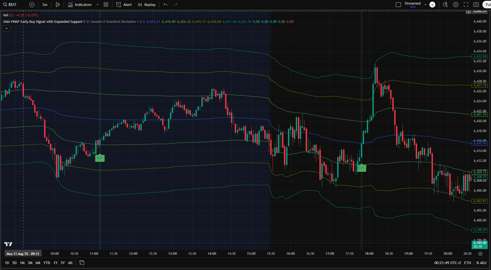

# EMA VWAP Crossover Buy Signals

A **TradingView Pine Script** indicator designed for **low-risk, high-reward scalping setups**.  
Best used on **3-minute candlesticks**, this tool combines **Exponential Moving Averages (EMAs)** with **VWAP (Volume Weighted Average Price)** and multiple support band levels to pinpoint high-probability **buy entries** during intraday trading.

⚠️ Important: Not recommended for use during low-volume periods or algo-dominated trading sessions, as signals may be unreliable in thin markets.

---

---

## 📎 Direct TradingView Access
Add the indicator directly from the public library:  
**[EMA VWAP Crossover Buy Signals](https://www.tradingview.com/script/CwsxodkT-EMA-VWAP-crossover-Buy-signals/)**

My TradingView profile: **[EmotionalTrader777](https://www.tradingview.com/u/EmotionalTrader777/)**

---

## 📸 Screenshot
*(Add a screenshot here, e.g., ``)*

---

## ✨ Features
- **Optimized for Scalping**:
  - Specifically tuned for 3-minute candlestick charts
- **EMA Cross Detection**:
  - Two configurable EMAs (fast and slow) to identify bullish momentum shifts
- **VWAP Support Zones**:
  - Three dynamic lower bands calculated using Standard Deviation or Percentage
  - Helps identify oversold levels relative to VWAP
- **Signal Classification**:
  - Different shades of green for varying oversold intensities
- **Stop-Loss Alerts**:
  - Marks “WRONG” if the trade moves against you beyond a set amount
- **Customizable Parameters**:
  - EMA lengths, VWAP anchor, band multipliers, and calculation mode

---

## 🛠 How It Works
1. **EMA Crossover** — Fast EMA crosses above Slow EMA = potential bullish reversal.
2. **Support Zone Check** — Price must be at or below VWAP, near defined support bands.
3. **Signal Classification**:
   - **Band 1–2** = mild oversold, early signal
   - **Band 2–3** = deeper oversold, stronger signal
   - **Below Band 3** = extreme oversold, highest conviction
4. **Stop-Loss Marking**:
   - If price drops by a set amount after signal, label as “WRONG” for trade review.

---

## ⚡ Use Cases
- **Intraday scalping** in volatile markets.
- **Dip buying** during strong trends.
- Filtering entries using both **trend (EMA)** and **mean reversion (VWAP)** signals.

---

## 📋 Inputs
| Input                      | Description                                   | Default |
|----------------------------|-----------------------------------------------|---------|
| EMA Length 1               | Fast EMA length                               | 9       |
| EMA Length 2               | Slow EMA length                               | 21      |
| Anchor Period               | VWAP reset period (Session/Week/Month)       | Session |
| Bands Calculation Mode      | Standard Deviation or Percentage             | SD      |
| Band Multipliers (#1, #2, #3)| Support zone distance multipliers            | 1, 2, 3 |

---

## 📦 Installation
1. Copy the code from `EMA-VWAP-Crossover-Buy-Signals.pine`
2. Open **TradingView**
3. Go to **Pine Editor**
4. Paste the code and click **Add to Chart**
5. Save the script to your account  
   *(or simply use the [direct link](https://www.tradingview.com/script/CwsxodkT-EMA-VWAP-crossover-Buy-signals/) above)*

---

## 📜 License
MIT License — free to use, modify, and share.

---

## 👤 Author
**EmotionalTrader**  
- Futures trader, Python learner, aspiring asset trader, horse whisperer, space cowboy  
- [TradingView Profile](https://www.tradingview.com/u/EmotionalTrader777/)  
- [GitHub](https://github.com/EmotionalTrader)
